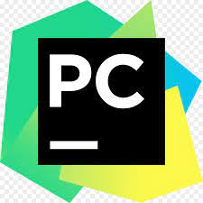

### Hi there, I'm Jeff👋

## I'm a Developer, and a Student!!

- 🔭 I’m currently working on several web projects (CSS & HTML)
- 🌱 I’m currently learning Javascript and everything 🤣
- 👯 I’m looking to collaborate with other programming enthusiasts
- 🥅 2021/22 Goals: Learn flutter-dart, react.js and node.js 💪
- ⚡ Fun fact: I love to books and research

### Connect with me:

[][twitter]
[][linkedin]
[][instagram]

 

### Tools:

### Languages:

 
 

---

### 📺 Guiding YouTube Channels 🎓

<!-- YOUTUBE:START -->

- [Free Code Camp](https://www.youtube.com/c/Freecodecamp)
- [Tech With Tim](https://www.youtube.com/c/TechWithTim)
- [Web Dev Simplified](https://www.youtube.com/c/WebDevSimplified)
- [Design Course)](https://www.youtube.com/c/DesignCourse)
- [Traversy Media](https://www.youtube.com/c/TraversyMedia)
<!-- YOUTUBE:END -->

---

### 📕 Suggested Blogs 🦉

<!-- BLOG-POST-LIST:START -->

- [Useful VS Code Extensions for FrontEnd Developers](https://www.smashingmagazine.com/2021/05/useful-vs-code-extensions-web-developers/)
- [Best VS Code Extensions - Blog - Ponicode](https://www.ponicode.com/blog/best-extensions-for-vs-code)
- [Emmet Part 1-Basics](https://www.codestackr.com/blog/emmet-basics-part-1/)
- [Emmet Part 2 - Advanced](https://dev.to/codestackr/emmet-part-2-advanced-4c65)
<!-- BLOG-POST-LIST:END -->

---

  
:zap: GitHub Stats

  

[twitter]: https://twitter.com/Theuri0411
[instagram]: https://instagram.com/jeffshady_
[linkedin]: https://linkedin.com/in/jeff-theuri-48818520b
